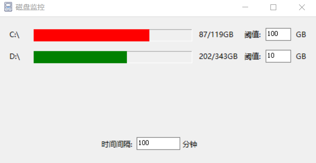
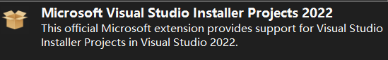
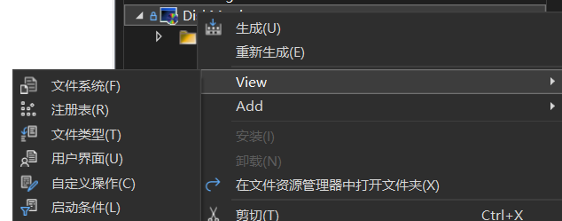

# DiskMonitor

## 发布

安装扩展

解决方案->新建项目->Setup Project->view->文件系统

1. 将整个 `bin\Release` 路径下的文件 (包括文件夹) Ctrl+A 全选 `复制`，选择 `Application Folder` ，点击 `粘贴`
2. 选择 Application Folder-> add项目输出 ->Create Shortcut to 主输出->拖拽快捷方式到User's Programs menu-> 修改名称，右键属性修改 Icon
3. 生成, 发布msi
